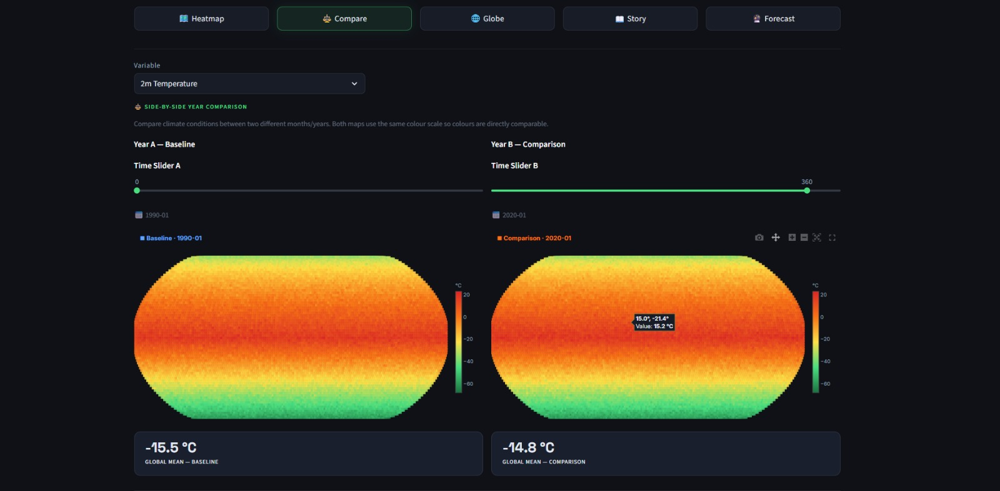
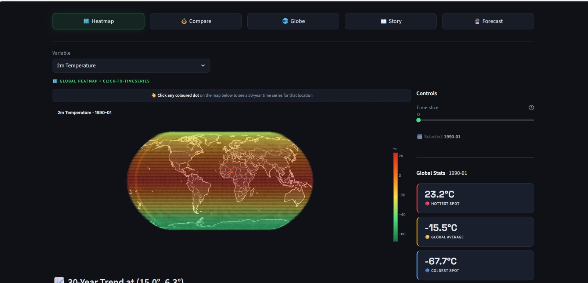
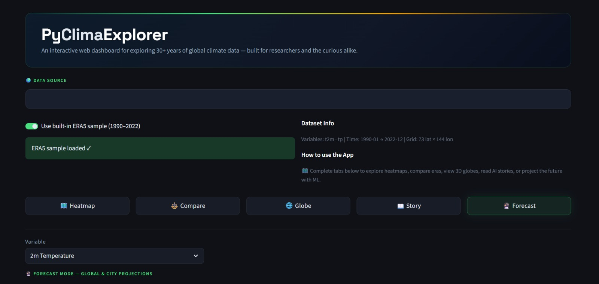
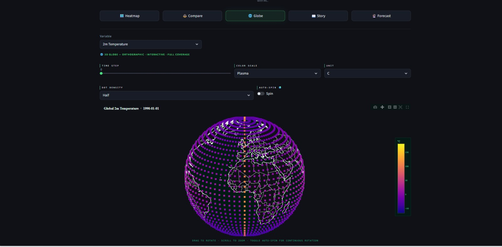
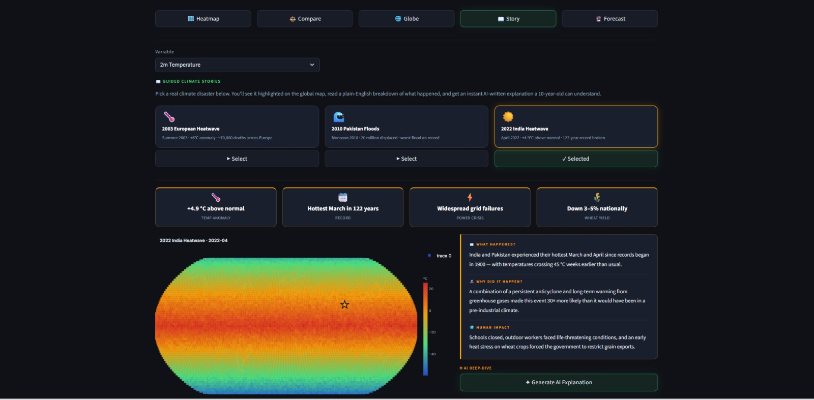
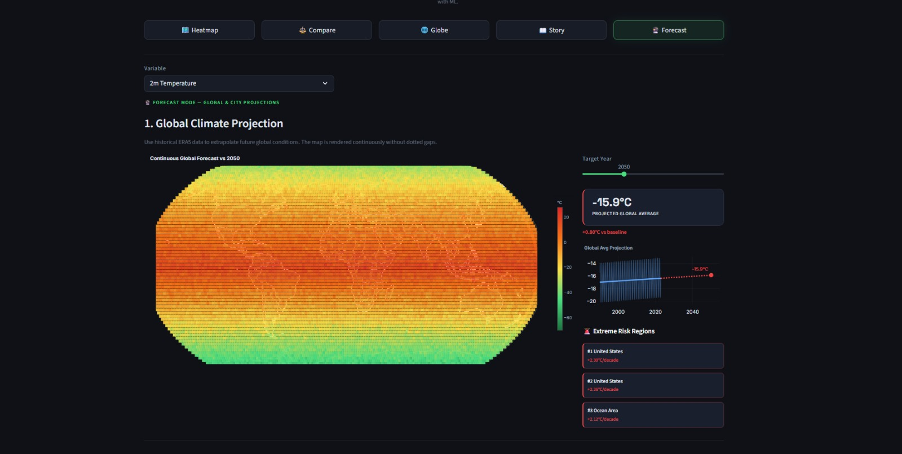
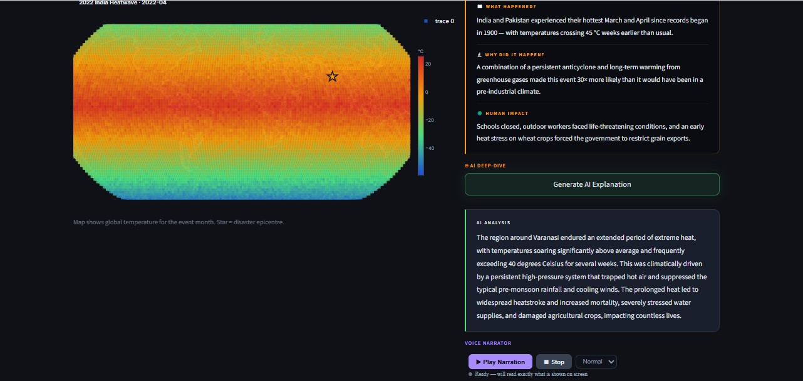
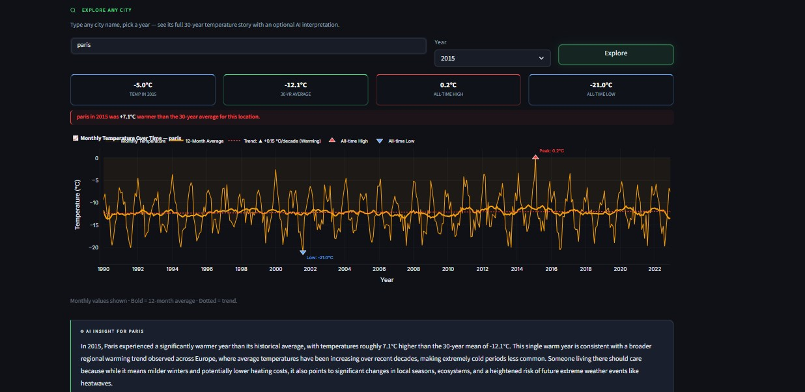
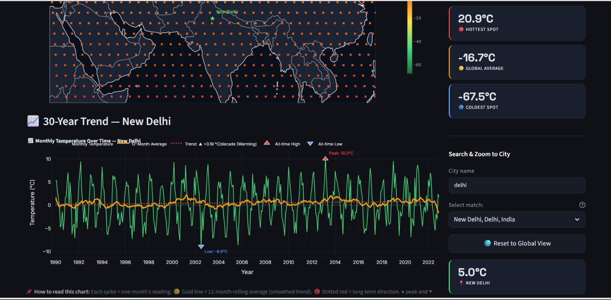
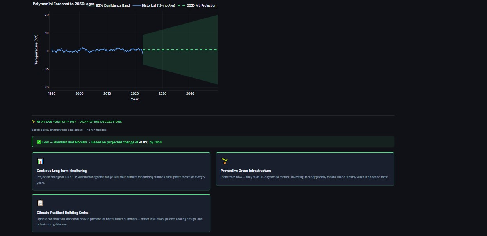

# PyClimaExplorer

> **Turn 30+ years of raw climate data into interactive stories, forecasts, and AI-powered insights — in your browser.**

[](https://python.org)
[](https://streamlit.io)
[](https://cds.climate.copernicus.eu)
[](https://aistudio.google.com)
[](LICENSE)
[%20Hackathon%202026-orange?style=flat-square&logo=academia&logoColor=white)](https://iitbhu.ac.in)

[](https://techsmiths-wicbce7pf2zf55npevebdc.streamlit.app/)

Built by **Team TechSmiths** at IIT(BHU) Varanasi — March 2026

---

## Demo



---

## What It Does

PyClimaExplorer is a full-stack climate data dashboard that lets researchers, students, and curious users explore Earth's temperature and precipitation records without writing a single line of code.

### Heatmap

Interactive global choropleth + city search + 30-year time series. Click any point on the map to pull up its full climate history.




### Compare

Side-by-side heatmaps for any two years with dual time series — directly compare climate conditions across decades.



### 3D Globe

PyDeck 3D orthographic globe — rotate, zoom, change colour scale and time step interactively.



### Story

Gemini AI narrates real climate events (2003 European Heatwave, 2010 Pakistan Floods, 2022 India Heatwave) with what happened, why, and human impact. Includes a voice narrator and city explore tool.





### Forecast

Pixel-wise ML regression projects temperature/precipitation to any year up to 2100. City-level forecasts include 95% confidence intervals and Gemini-powered risk summaries.




---

## Quick Start

**Prerequisites:** Python 3.9+

### 1. Clone & install

```bash
git clone https://github.com/<your-username>/pyclimaexplorer.git
cd pyclimaexplorer
pip install -r requirements.txt
```

### 2. Run

```bash
streamlit run app.py
```

Open [http://localhost:8501](http://localhost:8501) — the app loads with a built-in ERA5 sample dataset immediately. No sidebar, no setup required.

---

## Project Structure

```
pyclimaexplorer/
├── app.py                    # Main Streamlit entry point
├── requirements.txt
├── .streamlit/
│   └── config.toml           # Theme configuration
└── src/
    ├── config.py             # CSS, session state, API keys
    ├── data.py               # ERA5 loading & synthetic sample generation
    ├── utils.py              # Geocoding, nearest-index lookup, unit helpers
    ├── plotting.py           # Shared Plotly layout helpers & colorscale
    └── pages/
        ├── heatmap.py        # Normal mode
        ├── compare.py        # Compare mode
        ├── globe.py          # 3D Globe mode
        ├── story.py          # Story / AI mode
        └── future_scope.py   # Forecast mode (ML + Gemini)
```

---

## Data Sources

### Built-in sample (zero setup)
The app ships with a synthetic ERA5-like dataset spanning **1990–2022** covering both `t2m` (2-metre temperature) and `tp` (total precipitation). It works out of the box — no download, no account.

### Real ERA5 data (recommended for research)

1. Create a free account at [https://cds.climate.copernicus.eu](https://cds.climate.copernicus.eu)
2. Install the CDS API: `pip install cdsapi`
3. Run this download script:

```python
import cdsapi

c = cdsapi.Client()
c.retrieve(
    'reanalysis-era5-single-levels',
    {
        'product_type': 'monthly_averaged_reanalysis',
        'variable': '2m_temperature',
        'year': [str(y) for y in range(1990, 2024)],
        'month': [f'{m:02d}' for m in range(1, 13)],
        'time': '00:00',
        'format': 'netcdf',
    },
    'era5_t2m.nc'
)
```

4. In the app, toggle **off** the sample data switch and upload your `era5_t2m.nc` file.

---

## How the ML Forecast Works

The **Forecast Mode** runs a **pixel-wise regression** across every spatial grid point:

```
For each (lat, lon) pixel:
  1. Extract the full monthly time series (1990–2022)
  2. Fit a Polynomial (degree 2) regression on decimal year
  3. Project forward to the target year (2030–2100)
  4. Compute decadal rate-of-change for risk ranking
```

This means the app trains **~10,000+ independent models** simultaneously (one per grid cell) using `numpy.linalg.lstsq` — fast enough to run in a browser thanks to `@st.cache_data`.

City-level forecasts extend to 2050 and include **95% confidence intervals** that widen with projection distance, giving an honest uncertainty representation.

> **Limitations:** This is a trend extrapolation, not a climate simulation. Results should be interpreted as illustrative projections, not scientific predictions. For research use, see CMIP6 models.

---

## Tech Stack

| Library | Purpose |
|---------|---------|
| [](https://streamlit.io) | Web framework & reactive UI |
| [](https://xarray.pydata.org) | NetCDF / ERA5 data handling |
| [](https://plotly.com/python/) | Interactive heatmaps, time series, globe |
| [](https://deckgl.readthedocs.io) | 3D column map visualization |
| [](https://geopy.readthedocs.io) | City name to lat/lon geocoding |
| [](https://numpy.org) | Pixel-wise regression, statistics |
| [](https://aistudio.google.com) | Climate storytelling & risk summaries |

---

## Deploy to Streamlit Cloud

1. Push this folder to a **public GitHub repository**
2. Go to [https://share.streamlit.io](https://share.streamlit.io)
3. Click **New app** → select your repo → set `app.py` as the main file
4. Click **Deploy** — you get a live public URL with HTTPS

> The app uses `@st.cache_data` throughout so Streamlit Cloud's resource limits are respected. Cold start is ~15 seconds on the free tier.

---

## Configuration

`.streamlit/config.toml` controls the app theme. To switch to light mode:

```toml
[theme]
base = "light"
primaryColor = "#ef4444"
```

---

## Roadmap

- [ ] Add CMIP6 model comparison alongside the regression forecast
- [ ] Support precipitation anomaly maps (not just absolute values)
- [ ] Add city-to-city climate comparison
- [ ] Export charts as PNG / CSV
- [ ] Multi-language support (Hindi, Spanish, French)

---

## Team TechSmiths

| Member | Role |
|--------|------|
| **Ayushi Agrawal** | Full-stack development · ML forecast module · Feature architecture |
| **Jhalak Mittal** | Feature development · Data pipeline · ERA5 integration · Bug fixes & integration support |
| **Neha Malhotra** | Ideation & product design · Story mode · Gemini AI integration · Feature development |
| **Reshmi Yadav** | UI/UX & frontend development · Plotly visualizations · Technical documentation |

IIT(BHU) Varanasi · Hackathon 2026

---

## License

MIT License — see [LICENSE](LICENSE) for details.

---

## Acknowledgements

- ERA5 data provided by the [Copernicus Climate Change Service (C3S)](https://cds.climate.copernicus.eu)
- Geocoding powered by [Nominatim / OpenStreetMap](https://nominatim.openstreetmap.org)
- AI features powered by [Google Gemini](https://aistudio.google.com)